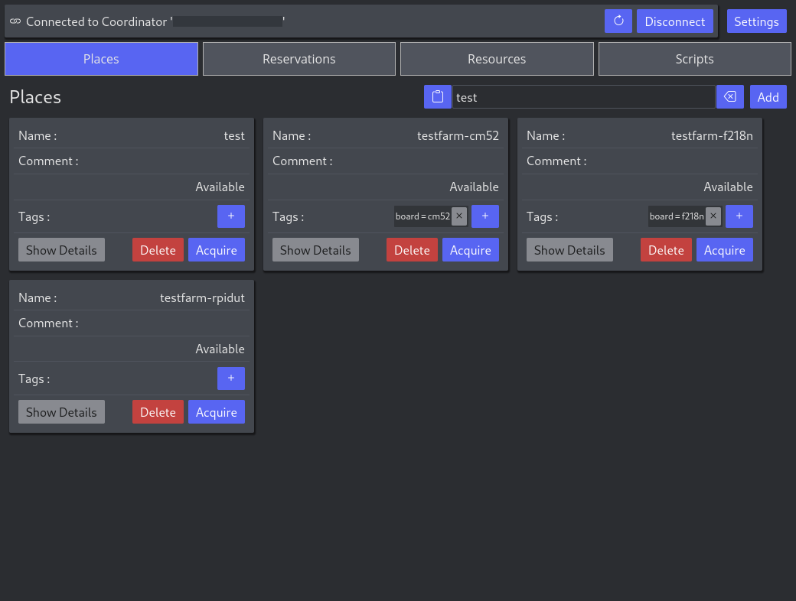
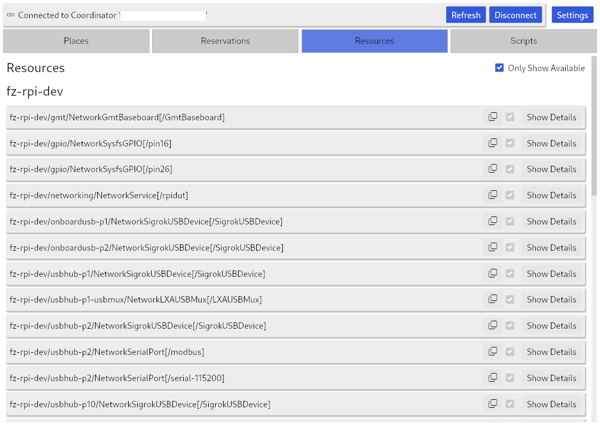
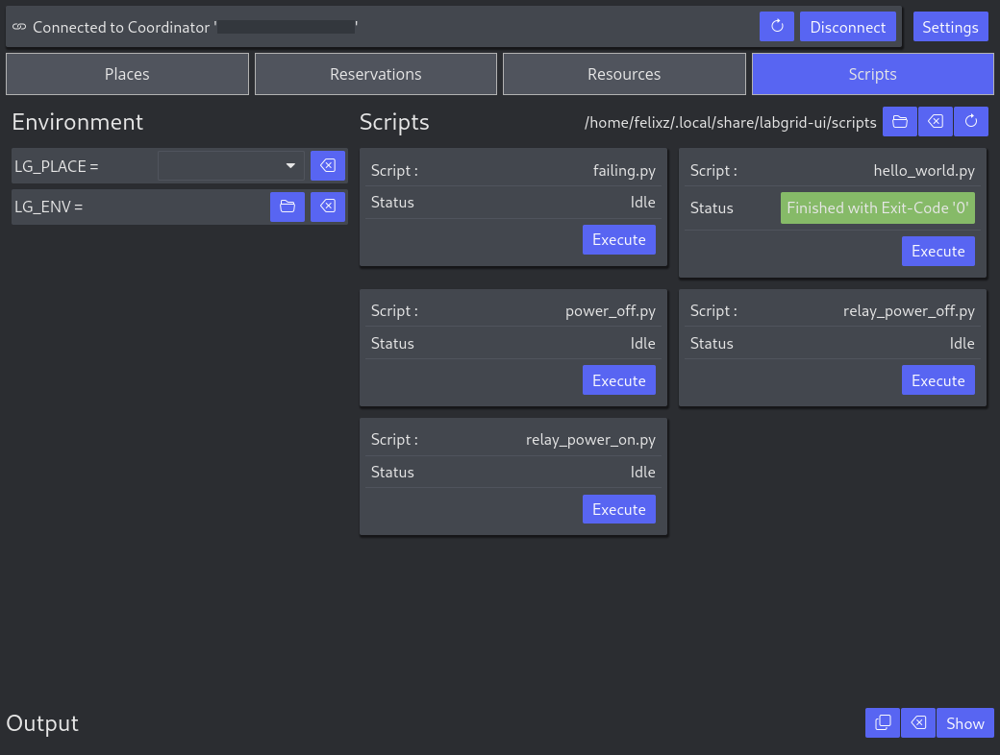

<!--
SPDX-FileCopyrightText: 2025 Duagon Germany GmbH

SPDX-License-Identifier: CC0-1.0
-->

# labgrid-ui

Client UI for labgrid.

Written in [rust](https://www.rust-lang.org/), using [iced](https://crates.io/crates/iced) for the UI
and [tonic](https://crates.io/crates/tonic) for gRPC communication with the coordinator.

# labgrid coordinator

The application currently works with coordinator that runs on a fork of labgrid
that has gRPC exported resources array support.
see: https://github.com/labgrid-project/labgrid/pull/1442.
Because the protobuf definition *should* be backward compatible, it might also work with upstream labgrid.

# Usage

The recommended way to use the app is to download the flatpak:

https://git.duagon.com/project/general/tools/labequipment/labgrid-ui/-/jobs/artifacts/main/browse?job=build-ui-flatpak

And install it with:

```
flatpak install com.duagon.labgrid-ui.flatpak
```

Alternatively download the self-contained binary:

https://git.duagon.com/project/general/tools/labequipment/labgrid-ui/-/jobs/artifacts/main/browse?job=build-ui

And place it for example into `~/.local/bin` to have it in your `PATH`.
Though then the app will not be integrated into the desktop environment
and needs to be launched through the terminal with `labgrid-ui`.

You can also build and install the app yourself with:

```
just install-ui
```

Which also installs a `.desktop` file, the app icon and other auxiliary files which
will make the app appear in app launchers and desktop environments.
# WSL2

When using the latest WSL2, it is possible to launch the UI through it.

First install, then launch it in a WSL2 terminal:

```bash
labgrid-ui
```

It is also possible to create a script that launches the UI through WSL2.
Open a text editor and save the script with contents:

`labgrid-ui.ps1`
```powershell
wsl -e bash -lic "nohup labgrid-ui &"
```

Launch it with "Right Click->Context Menu->Run with Powershell".
Create a desktop shortcut with "Right Click->Context menu->More Options->Send To->Desktop (Create Shortcut)".

# Scripts

Once launched, the app will create directory `~/.local/share/labgrid-ui/scripts` and list all python and shell scripts
contained in it under the `Scripts` view.
This is a feature to be able to execute simple tasks from the UI in a flexible manner.
All scripts are launched with the virtual environment of the testfarm labgrid deployment, by default located in
`/opt/venvs/labgrid`, so `labgrid-client` and `lg_ext` commands are available.
By selecting the place `LG_PLACE` and the location of the environment configuration file `LG_ENV` in the UI users are
able to re-use these scripts, but it is also possible to create scripts that hardcode the configuration in order to
execute tasks for specific places.

A small selection of exemplary scripts is located in this repository under `./scripts`.

## Windows

It is possible to build the app on Windows, but the steps are slightly more involved:

- Download the latest protobuf compiler from [here](https://github.com/protocolbuffers/protobuf/releases/latest)
- Place `protoc.exe` in a location that is added to the Windows `PATH` environment variable
- run `cargo run -p labgrid-ui` to build and run the app
- run `cargo install --path ./crates/ui` to install it. `labgrid-ui` should then be available in powershell.

# Screenshots








# Developing

see [DEVELOPING.md](./DEVELOPING.md)
